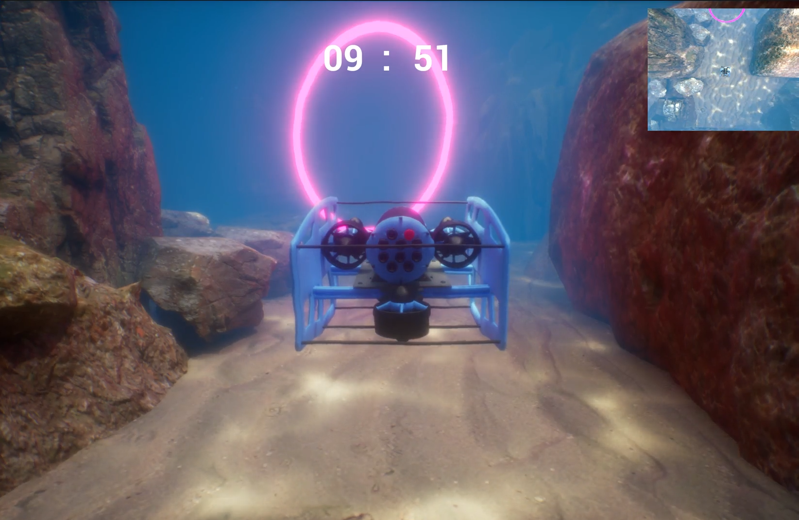

# Underwater-sim-HEM-ID
The simulator models an underwater remotely operated vehicle (ROV), BlueROV, for navigation tasks.   Participants teleoperate the ROV through different challenges that can lead to human-induced errors (mistakes, slips, and lapses).

## 🎬 Simulation Demos

### 🐠 Full Simulation Overview

Full video of the gameplay is present in `/full_gameplay_base_level.mp4`. This video shows the underwater teleoperation task, where the ROV navigates through the ring-collection course under varying visibility and depth conditions.

---

## 💻 Technical details

| Component | Setting |
|------------|----------|
| **Engine version** | Unreal Engine 5.3.2 |
| **Platform** | Windows 10/11 |
| **Project type** | Blueprint-only |
| **Lighting** | Lumen (Global Illumination + Reflections) |
| **World partition** | Enabled |
| **Physics engine** | Chaos |
| **Plugins used** | Niagara FX, Chaos Solver, Enhanced Input (disabled by default), Gameplay Cameras |
| **Main map** | `Content/VehicleTemplate/Maps/vehicleExampleMap.umap` |
| **Main pawn** | `BP_BlueROV` (classical input / floating-pawn movement) |
| **Default GameMode** | `BP_GameMode` |
| **Input system** | Classic Input (see bindings below) |
| **Rendering target** | Windows (DX12) |
| **License** | CC BY-NC 4.0 (non-commercial; attribution required) |

---

## Quick start
1. Open the `base_level.uproject` in UE 5.3.2.
2. Open **`VehicleTemplate/Maps/vehicleExampleMap.umap`**.
3. Download the required assets and materials through UE. See **`Docs/Add-Assets.md`** and the list in **`Docs/Required_Assets.csv`**.
4. **First run only:** `Build → Build All Levels` → **Save All**, then reopen the map.
5. Press **Play**.

## 🕹️ Controls

| Key | Function |
|-----|-----------|
| **W** | Ascend (up) |
| **S** | Descend |
| **↑ Up Arrow** | Move forward |
| **↓ Down Arrow** | Move backward |
| **← / → Arrows** | Turn left / right |
| **V** | Toggle camera (first ↔ third person) — press twice to switch |
| **Esc** | End simulation (Quit PIE) |

> **Tip 1:** The vehicle spawns on the seabed. Ascend (**W**) first before moving forward; otherwise the robot remains embedded in the sand.  
> **Tip 2:** An upper-depth limit prevents surfacing above the water. If you reach it, upward motion stops.  
> **Tip 3:** The first time you open the project, select **Build → Build All Levels**, then **Save All**. If Unreal shows “4 Landscape actors need rebuild,” open **Landscape mode → Build All Landscapes** once.

---

## 🧠 Research context (THRI paper)

This simulator was the testbed for evaluating **Intelligent Disobedience (ID)** strategies in human–robot collaboration and this level was developed as the base (control) level with the three types of human-induced errors embedded in the simulation. The idea was to use this testbed to study the different ID strategies to mitigate the human-induced errors through a wizard-of-oz experiment approach.

Participants completed timed ring-collection tasks under varying visibility and environmental conditions.  
Data collected included task completion time, collision count, NASA-TLX workload, MDMT trust, and acceptance ratings. Please refer to the paper for more information: 

---

## 🪪 License

This project’s code, Blueprints, and documentation are licensed under  
**[Creative Commons Attribution–NonCommercial 4.0 International (CC BY-NC 4.0)](https://creativecommons.org/licenses/by-nc/4.0/)**.

External assets (Quixel Megascans and Unreal Marketplace content) are **not included** and remain subject to the  
[Epic Games EULA](https://www.epicgames.com/site/en-US/eula) and individual asset licenses.  
See [Docs/ASSETS.md](Docs/ASSETS.md) for details.

## Citation
If you use this simulator, please cite it. See `CITATION.cff`.
(doi badge will go here after you mint it)
